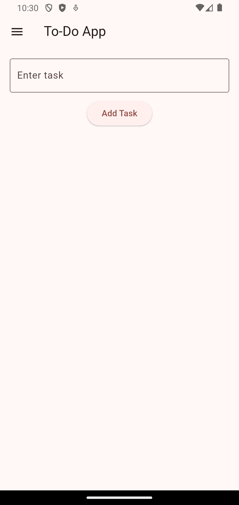

# Flutter To-Do List App

A simple yet powerful **To-Do List App** built with **Flutter** and **Provider** for state management.

## Features
✅ Add tasks  
✅ Mark tasks as completed  
✅ Delete tasks  
✅ Persistent storage (Tasks are saved even after closing the app)  
✅ Adaptive UI with Navigation Drawer  

## Screenshots


## Installation
1. Clone the repository:
   ```sh
   git clone https://github.com/YOUR_USERNAME/flutter-todo-app.git
